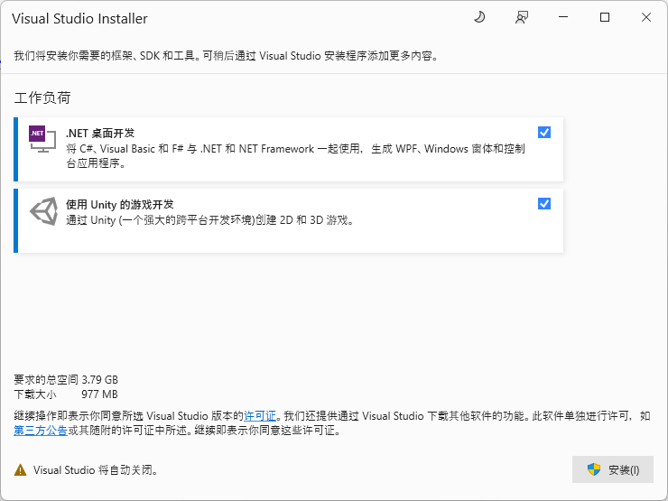

在进行开发之前，还请先按照此章节配置环境与了解一些事项！

## 前言

为了确保您的开发顺利

我们将会推荐您使用的软件环境与插件环境

以及项目的一些设置

还请耐心看完！感谢配合qwq

## 软件环境

Unity 2021.3.13f1(并不为CN版)：[UnityHub](unityhub://2021.3.12f1/8af3c3e441b1 "将跳转到UnityHub下载")/[直链下载](https://download.unity3d.com/download_unity/8af3c3e441b1/Windows64EditorInstaller/UnitySetup64-2021.3.12f1.exe)

编辑器：[VsCode](https://code.visualstudio.com/)/[Visual Studio 2022](https://visualstudio.microsoft.com/zh-hans/)（二选一）

代码托管：[PlasticSCM](https://unity.cn/plasticscm)（需要先提前加入组织）

## 插件环境

为了能让开发顺利展开，并且尽可能统一代码规范，还请额外安装以下插件！

### VsCode

* [Unity Dev Pack - Visual Studio Marketplace](https://marketplace.visualstudio.com/items?itemName=fabriciohod.unity-dev-pack)（建议安装）
* 自行准备代码格式化插件

### Visual Studio

* [CodeMaid VS2022 - Visual Studio Marketplace](https://marketplace.visualstudio.com/items?itemName=SteveCadwallader.CodeMaidVS2022)
* [Auto Save File - Visual Studio Marketplace](https://marketplace.visualstudio.com/items?itemName=HRai.AutoSaveFile)（建议安装）

在安装时建议选择下图中的两项



### Unity

建议只选择“语言包-简体中文”


## 项目

为了您的开发顺利，我们将简单介绍一下项目

### 文件目录

```bash
├─Audio
├─I2	//国际化文件夹
│  ├─Flags	//各个国家的国旗
├─Prefab	//预制件
│  ├─Display	//显示分类
│  │  └─Buildings	//建筑子类
│  │      └─Test	//场景名/使用用途
│  │          └─Decorate
│  └─Function	//功能分类
├─Resources	//资源文件夹
│  ├─AudioClip	//音频文件夹
│  │  ├─BGM	//背景音乐
│  │  │  └─MainMenu	//场景名
│  │  └─UI	//UI音效
│  └─Texture	//贴图
│      ├─Buildings	//建筑
│      │  └─Test	//场景名/使用用途
│      │      └─Decorate
│      ├─Characters	//角色
│      │  └─Player	//角色名
│      ├─Menu	//菜单
│      └─TileMap	//场景贴图
│          └─Test	//场景名/使用用途
│              └─Assests
├─Scenes	//场景
├─Script	//脚本
│  ├─Audio	//音频
│  ├─BasicSystem	//基本系统
│  │  ├─ControlSystem	//控制系统
│  │  │  └─Player	//玩家
│  │  │      └─Move	//移动
│  │  ├─FileSystem	//文件系统
│  │  ├─SaveStstem	//存档系统
│  │  │  ├─Data
│  │  │  └─SerializableTypes
│  │  └─UISystem	//UI系统
│  └─Menu
├─Settings
│  └─Scenes
└─TextMesh Pro
    ├─Documentation
    ├─Fonts	//字体文件夹
    ├─Resources
    │  ├─Fonts & Materials
    │  ├─Sprite Assets
    │  └─Style Sheets
    ├─Shaders
    └─Sprites
```
